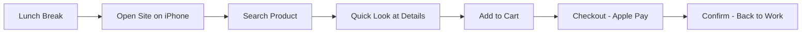
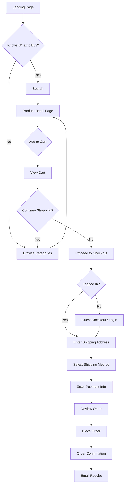

# Phần 3: Thiết kế và Phát triển Ứng dụng (Quy trình Thực tế Đầy đủ)

## 📋 Tổng quan Software Development Life Cycle (SDLC)

Phần này trình bày quy trình phát triển phần mềm thực tế từ A-Z, được áp dụng cụ thể cho Project IDX theo chuẩn quốc tế.

```
┌─────────────────────────────────────────────────────────────┐
│         SOFTWARE DEVELOPMENT LIFE CYCLE (SDLC)              │
├─────────────────────────────────────────────────────────────┤
│                                                               │
│  1. REQUIREMENTS     →  2. DESIGN      →  3. IMPLEMENTATION │
│     ANALYSIS              (UI/UX + Tech)      (Coding)       │
│         ↓                     ↓                    ↓         │
│  • User Stories       • Wireframes        • Sprint Planning  │
│  • Use Cases          • Mockups           • Daily Development│
│  • Requirements       • Architecture      • Code Review      │
│    Document           • Database Schema   • Unit Testing     │
│         │                     │                    │         │
│         └─────────────────────┴────────────────────┘         │
│                           ↓                                   │
│  4. TESTING         →  5. DEPLOYMENT    →  6. MAINTENANCE    │
│     (QA)                  (Release)          (Support)        │
│         ↓                     ↓                    ↓         │
│  • Integration Test   • Staging Deploy    • Bug Fixes       │
│  • E2E Testing        • Production Deploy • Feature Updates  │
│  • UAT                • Monitoring Setup  • Performance      │
│  • Performance Test   • Rollback Plan     • User Feedback   │
│                                                               │
└─────────────────────────────────────────────────────────────┘
```

---

## PHASE 1: REQUIREMENTS ANALYSIS (Phân tích Yêu cầu)

### 1.1. Thu thập Yêu cầu (Requirements Gathering)

#### A. Stakeholder Meeting - Quy trình Thực tế

**Meeting Checklist:**

```markdown
## Checklist Chuẩn bị Meeting với Stakeholders

### Pre-Meeting (1 tuần trước)
- [ ] Xác định stakeholders (Product Owner, Users, Business Analysts, Technical Lead)
- [ ] Gửi agenda và questionnaire trước
- [ ] Chuẩn bị tools: Meeting notes (Google Docs), Recording software (Zoom), Whiteboard (Miro)
- [ ] Book meeting room/Zoom link
- [ ] Review business context và existing documentation

### During Meeting (2-3 giờ)
1. **Introduction (15 phút)**
   - Giới thiệu team members
   - Clarify meeting objectives
   - Present timeline overview
   - Set expectations

2. **Business Context (30 phút)**
   - Vấn đề hiện tại (Current pain points)
   - Giải pháp đề xuất (Proposed solution)
   - Target users (Demographics, behaviors)
   - Success metrics (KPIs, OKRs)
   - Business constraints (Budget, timeline)

3. **Functional Requirements (60 phút)**
   - Core features (MUST have - blocker nếu không có)
   - Nice-to-have features (SHOULD have - important nhưng không critical)
   - Future features (COULD have - if time permits)
   - Ask "Why?" for each feature để understand real need

4. **Non-Functional Requirements (30 phút)**
   - Performance expectations (response time, throughput)
   - Security requirements (authentication, authorization, encryption)
   - Scalability needs (concurrent users, data volume)
   - Compliance (GDPR, HIPAA, SOC2, etc.)
   - Accessibility (WCAG 2.1 Level AA)
   - Browser/Device support

5. **Q&A and Next Steps (15 phút)**
   - Address concerns
   - Clarify ambiguities
   - Define follow-up actions
   - Schedule next meeting

### Post-Meeting (2-3 ngày sau)
- [ ] Transcribe và organize notes
- [ ] Create Requirements Document (PRD - Product Requirements Document)
- [ ] Share with stakeholders for review
- [ ] Collect feedback và iterate
- [ ] Schedule follow-up meeting if needed
- [ ] Create initial backlog in Jira/Linear/GitHub Issues
```

#### B. Tạo User Stories - Template và Ví dụ Thực tế

**User Story Template Chuẩn:**

```markdown
## USER STORY TEMPLATE

**As a** [type of user]
**I want** [goal/desire]
**So that** [benefit/value]

### Acceptance Criteria
- [ ] Given [context], When [action], Then [outcome]
- [ ] Given [context], When [action], Then [outcome]
- [ ] Edge case: [scenario]

### Technical Notes
- API endpoints needed: [list]
- Database changes: [tables/columns]
- External dependencies: [services]
- Performance requirements: [metrics]

### Definition of Done
- [ ] Code implemented và tested
- [ ] Unit tests written (>80% coverage)
- [ ] Integration tests passing
- [ ] Code review approved
- [ ] Documentation updated
- [ ] Deployed to staging
- [ ] QA signed off
- [ ] Product Owner accepted

### Estimation
- Story Points: [fibonacci: 1, 2, 3, 5, 8, 13]
- Priority: [High/Medium/Low]
- Sprint: [Sprint number]
- Dependencies: [Other stories]

---

## VÍ DỤ THỰC TẾ: E-COMMERCE APPLICATION

### User Story #1: User Registration
**As a** new customer
**I want to** create an account with email and password
**So that** I can save my shopping preferences and track my order history

#### Acceptance Criteria
- [ ] Given I'm on registration page, When I enter valid email, password, first name, last name and submit, Then account is created and verification email is sent
- [ ] Given I enter existing email, When I submit, Then error message "Email already registered" appears
- [ ] Given I enter weak password (<8 chars, no uppercase/number/special), When I submit, Then inline error appears with requirements
- [ ] Given passwords don't match, When I submit, Then error "Passwords do not match" appears
- [ ] Given I click verification link in email, When token is valid, Then account is activated and I can login
- [ ] Given verification email failed to send, When registration completes, Then user sees warning to contact support

#### Technical Notes
```typescript
// API Endpoint
POST /api/auth/register
Request Body: {
  email: string,              // Required, must be valid email format
  password: string,           // Min 8 chars, 1 uppercase, 1 number, 1 special
  confirmPassword: string,    // Must match password
  firstName: string,          // Required, 1-100 chars
  lastName: string            // Required, 1-100 chars
}

Response (201 Created): {
  user: {
    id: string,
    email: string,
    firstName: string,
    lastName: string,
    emailVerified: false
  },
  message: "Registration successful. Please check your email to verify your account."
}

Response (400 Bad Request): {
  error: "Email already registered" | "Invalid email format" | "Weak password",
  details: { field: string, message: string }[]
}

// Database Schema (Prisma)
model User {
  id                String    @id @default(uuid())
  email             String    @unique
  password          String    // bcrypt hashed
  firstName         String?
  lastName          String?
  emailVerified     Boolean   @default(false)
  verificationToken String?   @unique
  tokenExpiry       DateTime?
  createdAt         DateTime  @default(now())
  updatedAt         DateTime  @updatedAt
  
  @@map("users")
}
```

#### Testing Scenarios
| Scenario | Input | Expected Output | Priority |
|----------|-------|-----------------|----------|
| Happy path | Valid all fields | Success + email sent | P0 |
| Invalid email | "notanemail" | Error: Invalid format | P0 |
| Duplicate email | Existing email | Error: Already registered | P0 |
| Weak password | "pass123" | Error: Requirements list | P0 |
| Password mismatch | Different passwords | Error: Don't match | P0 |
| Missing required field | Empty firstName | Error: Required | P1 |
| Email service down | Valid data | Success but warning shown | P1 |
| SQL injection attempt | '; DROP TABLE users-- | Sanitized and rejected | P0 |

#### Performance Requirements
- Registration API response: < 500ms (p95)
- Email send: < 2 seconds (async, non-blocking)
- Concurrent registrations: 100/second

#### Security Considerations
- Password hashed with bcrypt (cost factor: 12)
- Verification token: 32-byte random hex (crypto.randomBytes)
- Token expiry: 24 hours
- Rate limiting: 5 attempts per IP per hour
- CAPTCHA after 3 failed attempts

#### Estimation
- Story Points: **5** (Medium complexity)
- Priority: **High** (Blocker for other features)
- Sprint: **Sprint 1**
- Dependencies: 
  - Email service configuration
  - Database migrations
  - Authentication middleware

#### UI Mockup References
- Figma: [Link to design]
- Similar implementation: Airbnb, Stripe registration flow

---

### User Story #2: Product Search with Filters
**As a** customer
**I want to** search for products by name, category, or description with advanced filters
**So that** I can quickly find exactly what I'm looking for

#### Acceptance Criteria
- [ ] Given I'm on any page, When I type in search bar, Then autocomplete suggestions appear (debounced 300ms)
- [ ] Given I enter search term and press Enter, When results load, Then I see products matching name, description, or category
- [ ] Given search results displayed, When I apply filters (category, price range, rating, availability), Then results update in real-time
- [ ] Given I apply multiple filters, When I click "Clear all", Then all filters reset and show all products
- [ ] Given search query has typos, When I search, Then system suggests corrections ("Did you mean: laptop?")
- [ ] Given no results found, When I search, Then helpful message with suggestions appears
- [ ] Given I sort by price/relevance/newest, When I change sort order, Then results reorder correctly
- [ ] Given search results, When I scroll to bottom, Then next page loads (infinite scroll or pagination)

#### Technical Notes
```typescript
// API Endpoint
GET /api/products/search
Query Parameters: {
  q: string,                  // Search term (required if no filters)
  categories?: string[],      // Filter by category IDs
  minPrice?: number,          // Min price filter
  maxPrice?: number,          // Max price filter
  minRating?: number,         // Min rating filter (1-5)
  inStock?: boolean,          // Only in-stock products
  sortBy?: 'relevance' | 'price_asc' | 'price_desc' | 'newest' | 'rating',
  page?: number,              // Page number (default: 1)
  limit?: number              // Items per page (default: 20, max: 100)
}

Response (200 OK): {
  products: Product[],
  totalCount: number,
  page: number,
  totalPages: number,
  filters: {
    categories: { id: string, name: string, count: number }[],
    priceRange: { min: number, max: number },
    availableFilters: string[]
  },
  suggestions?: string[]      // For typo corrections
}

// Elasticsearch Query (Backend Implementation)
{
  "query": {
    "bool": {
      "must": [
        {
          "multi_match": {
            "query": "laptop",
            "fields": ["name^3", "description", "category^2"],
            "fuzziness": "AUTO",              // Handle typos
            "operator": "and"
          }
        }
      ],
      "filter": [
        { "terms": { "categoryId": ["cat-1", "cat-2"] } },
        { "range": { "price": { "gte": 500, "lte": 2000 } } },
        { "range": { "rating": { "gte": 4.0 } } },
        { "term": { "inStock": true } }
      ]
    }
  },
  "sort": [
    { "_score": "desc" },                    // Relevance
    { "price": "asc" }                       // Then by price
  ],
  "aggs": {
    "categories": {
      "terms": { "field": "categoryId" }
    },
    "priceStats": {
      "stats": { "field": "price" }
    }
  }
}

// Frontend State (React)
interface SearchState {
  query: string;
  filters: {
    categories: string[];
    priceRange: [number, number];
    minRating: number;
    inStock: boolean;
  };
  sortBy: SortOption;
  results: Product[];
  loading: boolean;
  error: string | null;
  totalCount: number;
  currentPage: number;
}
```

#### Performance Requirements
- Search response time: < 2 seconds (p95)
- Autocomplete response: < 300ms (p95)
- Concurrent searches: 1000/second
- Cache hit ratio: > 80% for popular queries
- Index update lag: < 5 minutes

#### Search Quality Metrics
- Relevance score (NDCG): > 0.85
- Zero results rate: < 5%
- Click-through rate: > 30%
- Typo handling accuracy: > 90%

#### Estimation
- Story Points: **8** (Complex - requires Elasticsearch setup)
- Priority: **High**
- Sprint: **Sprint 2**
- Dependencies: 
  - Elasticsearch cluster setup
  - Product catalog API
  - Search indexing pipeline
```

### 1.2. Phân tích và Ưu tiên (Analysis & Prioritization)

#### MoSCoW Method - Phân loại Feature

```markdown
## MOSCOW PRIORITIZATION FRAMEWORK

### MUST HAVE (Critical - Cannot launch without these)
**Rationale**: Core functionality required for MVP

1. ✅ User Authentication (Login/Register/Logout)
   - Impact: Blocker for personalization
   - Effort: 5 days
   - Risk: Low (well-established patterns)

2. ✅ Product Catalog (List/Detail pages)
   - Impact: Core business function
   - Effort: 8 days
   - Risk: Low

3. ✅ Shopping Cart (Add/Remove/Update quantities)
   - Impact: Required for checkout
   - Effort: 5 days
   - Risk: Low

4. ✅ Checkout & Payment (Stripe integration)
   - Impact: Revenue generation
   - Effort: 10 days
   - Risk: Medium (payment integration)

5. ✅ Order Management (View orders, order status)
   - Impact: Customer trust and support
   - Effort: 6 days
   - Risk: Low

**Total MUST HAVE: 34 days (6.8 weeks)**

### SHOULD HAVE (Important - But can workaround temporarily)
**Rationale**: Improves user experience significantly

6. 🟡 Product Search (Basic text search)
   - Impact: High (discovery)
   - Effort: 5 days
   - Risk: Low
   - Workaround: Browse by category

7. 🟡 Product Filters (Category, price, rating)
   - Impact: High (usability)
   - Effort: 4 days
   - Risk: Low
   - Workaround: Manual browsing

8. 🟡 User Profile Management (Edit profile, addresses)
   - Impact: Medium (convenience)
   - Effort: 3 days
   - Risk: Low
   - Workaround: Contact support to update

9. 🟡 Order History (Detailed order tracking)
   - Impact: Medium (transparency)
   - Effort: 3 days
   - Risk: Low
   - Workaround: Email confirmations

10. 🟡 Email Notifications (Order confirmation, shipping updates)
    - Impact: High (communication)
    - Effort: 4 days
    - Risk: Low
    - Workaround: Manual checking on site

**Total SHOULD HAVE: 19 days (3.8 weeks)**

### COULD HAVE (Nice to have - If time permits)
**Rationale**: Enhances experience but not critical

11. 🔵 Product Reviews & Ratings
    - Impact: Medium (social proof)
    - Effort: 8 days
    - Risk: Low

12. 🔵 Wishlist / Save for Later
    - Impact: Low (engagement)
    - Effort: 3 days
    - Risk: Low

13. 🔵 Product Recommendations (AI-powered)
    - Impact: Medium (discovery + revenue)
    - Effort: 12 days
    - Risk: High (ML complexity)

14. 🔵 Social Sharing (Share products)
    - Impact: Low (virality)
    - Effort: 2 days
    - Risk: Low

15. 🔵 Advanced Analytics Dashboard
    - Impact: Medium (business insights)
    - Effort: 10 days
    - Risk: Medium

**Total COULD HAVE: 35 days (7 weeks)**

### WON'T HAVE (Not in this release - Future roadmap)
**Rationale**: Out of scope for MVP, plan for later

16. ⚫ Mobile App (iOS/Android native apps)
    - Reason: Web-first strategy, mobile web sufficient for MVP
    - Future: Q3 2025

17. ⚫ Live Chat Support (Real-time customer service)
    - Reason: Email support sufficient initially
    - Future: Q2 2025 after volume increases

18. ⚫ Loyalty Program (Points, rewards)
    - Reason: Need customer base first
    - Future: Q4 2025

19. ⚫ Multi-language Support (i18n)
    - Reason: English-only market initially
    - Future: Q3 2025 for expansion

20. ⚫ Advanced Reporting Dashboard (BI tools)
    - Reason: Basic analytics sufficient
    - Future: Q4 2025

**Total WON'T HAVE: Deferred to future phases**
```

#### Product Roadmap - Timeline Chi tiết

```markdown
## 6-MONTH PRODUCT ROADMAP (Q1-Q2 2025)

### 🎯 Phase 1: MVP Development (Q1 2025) - 12 tuần

**Sprint 1 (Jan 2-15, 2 weeks): Foundation**
Goals:
  ✅ Development environment setup trong Project IDX
  ✅ Database schema design và migrations
  ✅ User authentication system (register, login, logout)
  ✅ Basic UI components library

Deliverables:
  - [ ] Users can register with email/password
  - [ ] Email verification working
  - [ ] Login/Logout functional
  - [ ] Basic dashboard layout

Story Points: 34
Team Capacity: 40 (buffer: 6 points)

**Sprint 2 (Jan 16-29, 2 weeks): Product Catalog**
Goals:
  ✅ Product listing page with pagination
  ✅ Product detail page
  ✅ Image upload và optimization
  ✅ Category management

Deliverables:
  - [ ] Browse products by category
  - [ ] View product details with images
  - [ ] Admin can add/edit products
  - [ ] Responsive design for mobile

Story Points: 32
Team Capacity: 40

**Sprint 3 (Jan 30 - Feb 12, 2 weeks): Shopping Cart**
Goals:
  ✅ Add to cart functionality
  ✅ Cart management (update quantity, remove)
  ✅ Cart persistence (logged in + guest)
  ✅ Cart summary và calculations

Deliverables:
  - [ ] Users can add products to cart
  - [ ] Update quantities
  - [ ] Remove items
  - [ ] See cart total with taxes

Story Points: 28
Team Capacity: 40

**Sprint 4 (Feb 13-26, 2 weeks): Checkout & Payment**
Goals:
  ✅ Multi-step checkout flow
  ✅ Stripe payment integration
  ✅ Shipping address management
  ✅ Order creation

Deliverables:
  - [ ] Checkout wizard (3 steps)
  - [ ] Payment with Stripe
  - [ ] Order confirmation page
  - [ ] Email receipt

Story Points: 38 (High complexity)
Team Capacity: 40

**Sprint 5 (Feb 27 - Mar 12, 2 weeks): Search & Filters**
Goals:
  ✅ Product search functionality
  ✅ Basic filters (category, price, rating)
  ✅ Sort options
  ✅ Performance optimization

Deliverables:
  - [ ] Search bar with autocomplete
  - [ ] Filter sidebar
  - [ ] Sort dropdown
  - [ ] URL params for shareability

Story Points: 30
Team Capacity: 40

**Sprint 6 (Mar 13-26, 2 weeks): Testing & Bug Fixes**
Goals:
  ✅ End-to-end testing
  ✅ Performance optimization
  ✅ Security audit
  ✅ Bug fixes và polish

Deliverables:
  - [ ] All critical bugs fixed
  - [ ] Performance targets met (LCP < 2.5s)
  - [ ] Security scan passed
  - [ ] Ready for production

Story Points: 25
Team Capacity: 40

**MVP Launch Date: March 31, 2025** 🚀

---

### 🌱 Phase 2: Growth Features (Q2 2025) - 12 tuần

**Sprint 7-8 (Apr 1-28, 4 weeks): Reviews & Engagement**
Features:
  - Product reviews và ratings
  - Review moderation system
  - Rating aggregation
  - Helpful votes on reviews

Business Impact:
  - Increase conversion rate by 15-20%
  - Improve SEO ranking
  - Build social proof

**Sprint 9-10 (Apr 29 - May 26, 4 weeks): Personalization**
Features:
  - Wishlist functionality
  - Product recommendations (based on browsing)
  - Recently viewed products
  - Email reminders for wishlisted items

Business Impact:
  - Increase repeat purchases by 25%
  - Higher engagement (time on site +30%)
  - Email open rate: 20-25%

**Sprint 11-12 (May 27 - Jun 23, 4 weeks): User Experience Polish**
Features:
  - Advanced user profile
  - Order history details
  - Saved payment methods
  - Shipping address book
  - Order tracking

Business Impact:
  - Reduce support tickets by 30%
  - Faster repeat checkouts
  - Higher customer satisfaction (NPS +15)

---

### 🚀 Phase 3: Scale & Optimize (Q3 2025) - 12 tuần

**Sprint 13-14: Search & Discovery**
  - Elasticsearch implementation
  - Faceted search
  - Search analytics
  - Smart suggestions

**Sprint 15-16: Performance & Infrastructure**
  - CDN optimization
  - Caching strategy (Redis)
  - Database query optimization
  - Load testing và tuning

**Sprint 17-18: Analytics & Business Intelligence**
  - Admin analytics dashboard
  - Revenue reporting
  - User behavior tracking
  - A/B testing framework

---

## SPRINT METRICS & TEAM CAPACITY

### Team Composition
- 2 Full-stack Engineers (Capacity: 32 points/sprint each)
- 1 Frontend Engineer (Capacity: 32 points/sprint)
- 1 Backend Engineer (Capacity: 32 points/sprint)
- 1 Designer (UX/UI) (Capacity: 20 points/sprint)
- 1 QA Engineer (Capacity: 25 points/sprint)
- 1 Product Owner (Part-time)
- 1 Scrum Master (Part-time)

**Total Team Capacity per Sprint**: 165 story points
**Planned Capacity per Sprint**: 130-140 points (buffer: 15-20%)

### Velocity Tracking
| Sprint | Planned | Completed | Velocity | Notes |
|--------|---------|-----------|----------|-------|
| Sprint 1 | 34 | TBD | - | Foundation sprint |
| Sprint 2 | 32 | TBD | - | - |
| Sprint 3 | 28 | TBD | - | - |
| Sprint 4 | 38 | TBD | - | Payment integration risk |
| Sprint 5 | 30 | TBD | - | - |
| Sprint 6 | 25 | TBD | - | Buffer sprint |

### Risk Management
| Risk | Probability | Impact | Mitigation |
|------|-------------|--------|------------|
| Stripe integration delays | Medium | High | Start early, have backup (PayPal) |
| Team member unavailability | Low | Medium | Cross-training, documentation |
| Scope creep | High | High | Strict change control, backlog grooming |
| Performance issues | Medium | High | Load testing in Sprint 5, monitoring |
| Security vulnerabilities | Low | Critical | Security audit in Sprint 6, pen testing |
```

---

## 3.1. Thiết kế UI/UX - Quy trình Thực tế Đầy đủ

### 3.1.1. Giai đoạn 1: User Research (1-2 tuần)

#### A. User Interviews - Structured Approach

**Target**: 10-15 potential users

**Interview Script (30 phút/người):**

```markdown
### PART 1: Background (5 phút)
1. How often do you shop online?
   - Daily / Weekly / Monthly / Rarely
   
2. What devices do you use for shopping?
   - Desktop / Laptop / Mobile / Tablet
   
3. What are your top 3 favorite shopping sites?
   - Ask WHY for each

### PART 2: Pain Points (10 phút)
4. What frustrates you the most about online shopping?
   - Slow loading
   - Confusing navigation
   - Hidden costs
   - Poor product information
   - Complicated checkout
   
5. Tell me about a recent online shopping experience that went badly.
   - What went wrong?
   - How did it make you feel?
   - Did you complete the purchase?
   
6. What would make your online shopping easier?

### PART 3: Workflow (10 phút)
7. Walk me through your last online purchase.
   - How did you find the product?
   - What information did you look for?
   - How long did it take to decide?
   - Any hesitations?
   
8. What makes you trust an online store?
   - Reviews
   - Security badges
   - Return policy
   - Brand recognition

### PART 4: Design Preferences (5 phút)
9. [Show 3-5 competitor screenshots]
   - Which design do you prefer? Why?
   - What catches your attention?
   - What confuses you?
   
10. Any features you wish existed?
```

**Analysis Approach:**
```markdown
### Affinity Mapping (Group similar responses)

Pain Points Identified:
1. Slow page loading (mentioned by 12/15 users) → Priority: HIGH
2. Hidden shipping costs (mentioned by 10/15 users) → Priority: HIGH
3. Complicated checkout (mentioned by 9/15 users) → Priority: HIGH
4. Poor mobile experience (mentioned by 8/15 users) → Priority: MEDIUM
5. Lack of product reviews (mentioned by 7/15 users) → Priority: MEDIUM

Design Preferences:
- Clean, minimal design (13/15 prefer)
- Large product images (15/15 want)
- Clear pricing (15/15 critical)
- Easy navigation (14/15 important)
```

#### B. Create User Personas (2 ngày)

**Persona Template:**

```markdown
## PERSONA 1: Sarah Chen - The Busy Professional

### Demographics
- **Age**: 32
- **Occupation**: Marketing Manager
- **Location**: Urban, San Francisco
- **Income**: $85,000/year
- **Education**: Bachelor's in Business
- **Family**: Single, lives alone

### Psychographics
- **Personality**: Efficient, goal-oriented, impatient
- **Values**: Quality, convenience, time-saving
- **Lifestyle**: Works 50+ hours/week, active social life

### Shopping Behavior
- **Frequency**: 2-3 times per week
- **Average Order Value**: $50-150
- **Preferred Devices**: iPhone 14 Pro (70%), MacBook Pro (30%)
- **Shopping Times**: Lunch breaks (12-1pm), evenings (8-10pm)
- **Payment Method**: Apple Pay, Credit Card

### Goals
1. Find products quickly (< 2 minutes)
2. Easy reordering of favorites
3. Fast, reliable delivery
4. Seamless checkout (ideally 1-click)

### Pain Points
1. ❌ Too many steps in checkout
2. ❌ Unclear product information
3. ❌ Slow website/app performance
4. ❌ Poor mobile experience
5. ❌ Having to create another account

### Technology Proficiency
- **Level**: Advanced
- **Apps Used Daily**: Amazon, Uber Eats, Spotify, Instagram
- **Expectations**: App-like web experience, instant feedback

### Quote
_"I don't have time to browse. I need to find what I want, buy it, and move on with my day."_

### User Journey


### Design Implications
✅ **Must Have:**
- Mobile-first responsive design
- Fast loading times (< 2s)
- Prominent search bar
- Quick reorder buttons
- Apple Pay / Google Pay integration
- Guest checkout option
- Saved addresses/payment methods

✅ **Nice to Have:**
- Product recommendations based on history
- One-tap reorder
- Push notifications for deals

---

## PERSONA 2: Michael Rodriguez - The Budget-Conscious Student

### Demographics
- **Age**: 22
- **Occupation**: College Student (Computer Science)
- **Location**: College Town, Boston
- **Income**: Part-time job $15k/year + financial aid
- **Education**: Undergrad Senior
- **Family**: Lives with roommates

### Shopping Behavior
- **Frequency**: Once per week
- **Average Order Value**: $20-40
- **Preferred Devices**: Android phone (60%), School laptop (40%)
- **Shopping Times**: Late night (10pm-12am), weekends
- **Payment Method**: Debit card, sometimes PayPal

### Goals
1. Find best deals and discounts
2. Compare prices easily
3. Free shipping if possible
4. Reviews from other students

### Pain Points
1. ❌ Hidden fees at checkout
2. ❌ Expensive shipping
3. ❌ Can't tell if product is worth the price
4. ❌ Worried about scams

### Design Implications
✅ **Must Have:**
- Clear pricing (no surprises)
- Prominent display of discounts
- Detailed product reviews
- Shipping cost calculator
- Price comparison tools
- Security badges

---

## PERSONA 3: Linda Thompson - The Thoughtful Parent

### Demographics
- **Age**: 41
- **Occupation**: HR Manager
- **Location**: Suburban, Dallas
- **Income**: $95,000/year (household: $160k)
- **Education**: Master's in Psychology
- **Family**: Married, 2 kids (ages 7, 10)

### Shopping Behavior
- **Frequency**: 1-2 times per week
- **Average Order Value**: $100-250
- **Preferred Devices**: iPad (50%), Desktop (30%), iPhone (20%)
- **Shopping Times**: After kids' bedtime (9-11pm), weekends
- **Payment Method**: Credit card (for rewards)

### Goals
1. Find quality products for family
2. Read detailed reviews
3. Easy returns if kids don't like it
4. Track orders and delivery

### Pain Points
1. ❌ Unclear return policy
2. ❌ Product descriptions lack detail
3. ❌ Hard to track multiple orders
4. ❌ Kids accidentally click ads

### Design Implications
✅ **Must Have:**
- Detailed product descriptions
- Multiple product images
- Clear return/refund policy
- Order tracking dashboard
- Parental controls (wishlist)
```

#### C. Competitive Analysis (3 ngày)

```markdown
## COMPETITIVE ANALYSIS FRAMEWORK

### Competitors Analyzed
1. **Amazon** - Market leader
2. **Shopify Stores** - Small business benchmark
3. **Etsy** - Niche marketplace
4. **Target.com** - Retail chain online
5. **Wayfair** - Furniture specialist

### Analysis Dimensions

| Feature | Amazon | Shopify | Etsy | Target | Wayfair | Our Goal |
|---------|--------|---------|------|--------|---------|----------|
| **Navigation** |
| Search Quality | ⭐⭐⭐⭐⭐ | ⭐⭐⭐ | ⭐⭐⭐⭐ | ⭐⭐⭐⭐ | ⭐⭐⭐⭐ | ⭐⭐⭐⭐⭐ |
| Filter Options | ⭐⭐⭐⭐⭐ | ⭐⭐⭐ | ⭐⭐⭐ | ⭐⭐⭐⭐ | ⭐⭐⭐⭐⭐ | ⭐⭐⭐⭐ |
| Category Structure | ⭐⭐⭐⭐ | ⭐⭐⭐ | ⭐⭐⭐⭐ | ⭐⭐⭐⭐ | ⭐⭐⭐⭐⭐ | ⭐⭐⭐⭐ |
| **Checkout** |
| Steps Count | 3 steps | 2-3 steps | 4 steps | 3 steps | 3 steps | 2 steps |
| Guest Checkout | ✅ Yes | ✅ Yes | ❌ No | ✅ Yes | ✅ Yes | ✅ Yes |
| Payment Options | 8+ | 5+ | 4 | 6+ | 7+ | 6+ |
| **Performance** |
| Load Time (LCP) | 1.8s | 2.5s | 2.8s | 2.1s | 2.3s | <2.0s |
| Mobile Score | 89/100 | 78/100 | 72/100 | 85/100 | 81/100 | >85/100 |
| **UX** |
| Mobile Experience | ⭐⭐⭐⭐⭐ | ⭐⭐⭐ | ⭐⭐⭐ | ⭐⭐⭐⭐ | ⭐⭐⭐⭐ | ⭐⭐⭐⭐⭐ |
| Visual Design | ⭐⭐⭐ | ⭐⭐⭐⭐ | ⭐⭐⭐⭐⭐ | ⭐⭐⭐⭐ | ⭐⭐⭐⭐ | ⭐⭐⭐⭐ |

### Key Findings

**Strengths to Emulate:**
1. **Amazon**: Search algorithms, filtering system, Prime benefits
2. **Etsy**: Beautiful visual design, seller stories, review quality
3. **Target**: Clean UI, excellent mobile experience
4. **Wayfair**: Room visualizer (AR), detailed product specs

**Weaknesses to Avoid:**
1. **Amazon**: Cluttered interface, aggressive upselling
2. **Shopify**: Inconsistent UX across stores
3. **Etsy**: Slow search, outdated checkout flow
4. **All**: Too many marketing popups

**Opportunities:**
1. Faster, cleaner search (beat everyone on speed)
2. Simplified checkout (2 steps instead of 3-4)
3. Better mobile experience than Shopify/Etsy
4. Modern, clean design (not cluttered like Amazon)
```

#### D. Information Architecture (2 ngày)

**Detailed Sitemap:**

```markdown
## SITE MAP - E-COMMERCE APPLICATION

Home Page (/)
│
├── 🏪 Shop (/shop)
│   │
│   ├── All Products (/shop/all)
│   │   └── Pagination + Filters
│   │
│   ├── 📁 Categories
│   │   ├── Electronics (/shop/electronics)
│   │   │   ├── Computers & Laptops
│   │   │   ├── Phones & Tablets
│   │   │   ├── Audio & Headphones
│   │   │   └── Cameras & Photography
│   │   │
│   │   ├── Clothing (/shop/clothing)
│   │   │   ├── Men's Clothing
│   │   │   ├── Women's Clothing
│   │   │   ├── Kids' Clothing
│   │   │   └── Accessories
│   │   │
│   │   ├── Home & Garden (/shop/home)
│   │   │   ├── Furniture
│   │   │   ├── Kitchen & Dining
│   │   │   ├── Bedding & Bath
│   │   │   └── Garden Tools
│   │   │
│   │   └── Sports & Outdoors (/shop/sports)
│   │       ├── Exercise & Fitness
│   │       ├── Camping & Hiking
│   │       ├── Water Sports
│   │       └── Team Sports
│   │
│   ├── 🔥 Deals & Promotions (/shop/deals)
│   │   ├── Flash Sales
│   │   ├── Clearance
│   │   └── Buy 2 Get 1
│   │
│   └── 🆕 New Arrivals (/shop/new)
│
├── 📦 Product Detail (/product/:id)
│   ├── Image Gallery (6-8 images)
│   ├── Product Info
│   ├── Specifications
│   ├── Reviews & Ratings
│   ├── Q&A Section
│   ├── Related Products
│   └── Recently Viewed
│
├── 🛒 Shopping Cart (/cart)
│   ├── Cart Items List
│   ├── Quantity Controls (+/-)
│   ├── Remove Items
│   ├── Save for Later
│   ├── Coupon Code Input
│   ├── Subtotal Calculation
│   └── Proceed to Checkout Button
│
├── 💳 Checkout (/checkout)
│   ├── Step 1: Shipping Address (/checkout/shipping)
│   │   ├── Saved Addresses
│   │   └── Add New Address Form
│   │
│   ├── Step 2: Shipping Method (/checkout/delivery)
│   │   ├── Standard (5-7 days) - FREE
│   │   ├── Express (2-3 days) - $9.99
│   │   └── Overnight - $24.99
│   │
│   ├── Step 3: Payment (/checkout/payment)
│   │   ├── Credit/Debit Card
│   │   ├── PayPal
│   │   ├── Apple Pay / Google Pay
│   │   └── Buy Now Pay Later (Klarna)
│   │
│   └── Step 4: Review & Confirm (/checkout/review)
│       ├── Order Summary
│       ├── Shipping Details
│       ├── Payment Method
│       └── Place Order Button
│
├── ✅ Order Confirmation (/order/confirmation/:id)
│   ├── Order Number
│   ├── Estimated Delivery
│   ├── Order Items
│   ├── Shipping Address
│   └── Email Confirmation Sent
│
├── 👤 Account (/account)
│   ├── Dashboard (/account/dashboard)
│   │   ├── Recent Orders
│   │   ├── Saved Items
│   │   └── Recommendations
│   │
│   ├── Profile (/account/profile)
│   │   ├── Personal Info
│   │   ├── Email & Phone
│   │   ├── Change Password
│   │   └── Delete Account
│   │
│   ├── Orders (/account/orders)
│   │   ├── Order History
│   │   ├── Track Order
│   │   ├── Return/Refund
│   │   └── Reorder
│   │
│   ├── Addresses (/account/addresses)
│   │   ├── Saved Addresses
│   │   ├── Add New
│   │   ├── Edit
│   │   └── Set Default
│   │
│   ├── Payment Methods (/account/payments)
│   │   ├── Saved Cards
│   │   ├── Add New Card
│   │   ├── PayPal Account
│   │   └── Set Default
│   │
│   ├── Wishlist (/account/wishlist)
│   │   ├── Saved Items
│   │   ├── Move to Cart
│   │   └── Price Drop Alerts
│   │
│   └── Settings (/account/settings)
│       ├── Notifications
│       ├── Privacy
│       └── Communication Preferences
│
├── 🔐 Authentication
│   ├── Login (/auth/login)
│   ├── Register (/auth/register)
│   ├── Forgot Password (/auth/forgot-password)
│   ├── Reset Password (/auth/reset-password)
│   └── Verify Email (/auth/verify-email)
│
├── ℹ️ About (/about)
│   ├── Our Story
│   ├── Team
│   └── Careers
│
├── 🔍 Search Results (/search?q=...)
│   ├── Results Grid
│   ├── Filters Sidebar
│   ├── Sort Options
│   └── Pagination
│
└── 📞 Support (/support)
    ├── FAQ (/support/faq)
    ├── Contact Us (/support/contact)
    ├── Shipping Info (/support/shipping)
    ├── Returns & Refunds (/support/returns)
    ├── Track Order (/support/track)
    └── Size Guide (/support/size-guide)

## USER FLOW DIAGRAMS

### PURCHASE JOURNEY (Happy Path)



### SEARCH & FILTER FLOW

```
[Homepage] → [Search Bar] → [Type Query] → [Autocomplete Results]
                                          ↓
                            [Press Enter / Click Result]
                                          ↓
                              [Search Results Page]
                                          ↓
                    ┌────────────────────┴────────────────────┐
                    ↓                                          ↓
            [Apply Filters]                           [Click Product]
            (Category, Price,                                 ↓
             Rating, etc.)                          [Product Detail]
                    ↓                                          ↓
            [Results Update]                          [Add to Cart]
                    ↓                                          ↓
            [Sort Results]                             [Checkout]
            (Price, Newest,
             Rating, etc.)
```
```

### 3.1.2. Giai đoạn 2: Wireframing & Prototyping (1 tuần)

#### A. Low-Fidelity Wireframes (Sketches)

**Purpose**: Rapid iteration on layout and structure

```
┌─────────────────────────────────────────────────────────────┐
│           HOMEPAGE - DESKTOP WIREFRAME (Low-Fi)             │
├─────────────────────────────────────────────────────────────┤
│                                                               │
│  ┌────────┐  [Search Products...]   🛒 Cart (3)  👤 John ▼ │
│  │  LOGO  │                                                  │
│  └────────┘                                                  │
│  ─────────────────────────────────────────────────────────  │
│  [Electronics ▼]  [Clothing ▼]  [Home ▼]  [Sports ▼]  [Deals]│
│                                                               │
│  ┌───────────────────────────────────────────────────────┐ │
│  │                                                         │ │
│  │         HERO BANNER                                    │ │
│  │         50% OFF Electronics                            │ │
│  │         [Shop Now →]                                   │ │
│  │                                                         │ │
│  └───────────────────────────────────────────────────────┘ │
│                                                               │
│  Featured Products                          [View All →]     │
│  ┌──────────┐ ┌──────────┐ ┌──────────┐ ┌──────────┐      │
│  │ [Image]  │ │ [Image]  │ │ [Image]  │ │ [Image]  │      │
│  │ Product 1│ │ Product 2│ │ Product 3│ │ Product 4│      │
│  │ $99.99   │ │ $149.99  │ │ $79.99   │ │ $199.99  │      │
│  │ ⭐⭐⭐⭐   │ │ ⭐⭐⭐⭐⭐ │ │ ⭐⭐⭐     │ │ ⭐⭐⭐⭐⭐  │      │
│  │ [Add]    │ │ [Add]    │ │ [Add]    │ │ [Add]    │      │
│  └──────────┘ └──────────┘ └──────────┘ └──────────┘      │
│                                                               │
│  Categories                                                   │
│  ┌─────────┐ ┌─────────┐ ┌─────────┐ ┌─────────┐         │
│  │[Icon]   │ │[Icon]   │ │[Icon]   │ │[Icon]   │         │
│  │Electron │ │Clothing │ │Home     │ │Sports   │         │
│  └─────────┘ └─────────┘ └─────────┘ └─────────┘         │
│                                                               │
│  ──────────────── FOOTER ────────────────                   │
│  About | Contact | Terms | Privacy | Shipping                │
│                                                               │
└─────────────────────────────────────────────────────────────┘


┌────────────────────────────────────────────────┐
│  PRODUCT DETAIL - MOBILE WIREFRAME (Low-Fi)    │
├────────────────────────────────────────────────┤
│                                                │
│  ← Back     🔍 🛒 Cart (3)  ⋯ Menu           │
│                                                │
│  ┌──────────────────────────────────────────┐│
│  │                                            ││
│  │        [Product Image]                    ││
│  │                                            ││
│  │  ○ ○ ● ○ ○  (Image dots)                ││
│  │                                            ││
│  └──────────────────────────────────────────┘│
│                                                │
│  Product Name Here                             │
│  ⭐⭐⭐⭐⭐ 4.8 (245 reviews)                    │
│                                                │
│  $99.99  ~~$149.99~~ (33% off)                │
│                                                │
│  ═══════════════════════════                  │
│                                                │
│  Description                                   │
│  Lorem ipsum dolor sit amet...                 │
│                                                │
│  Specifications                                │
│  • Spec 1: Value                              │
│  • Spec 2: Value                              │
│  • Spec 3: Value                              │
│                                                │
│  [Add to Cart]  [Buy Now]                     │
│                                                │
│  ───────────────────────────────              │
│                                                │
│  Customer Reviews                              │
│  ⭐⭐⭐⭐⭐ John D.                               │
│  "Great product!"                              │
│                                                │
│  [View All Reviews (245)]                     │
│                                                │
│  Related Products                              │
│  ┌────────┐ ┌────────┐                       │
│  │[Image] │ │[Image] │                       │
│  │$49.99  │ │$79.99  │                       │
│  └────────┘ └────────┘                       │
│                                                │
└────────────────────────────────────────────────┘
```

#### Giai đoạn 2: Information Architecture

**Sitemap Creation:**
```
Home
├── Shop
│   ├── All Products
│   ├── Categories
│   │   ├── Electronics
│   │   ├── Clothing
│   │   ├── Home & Garden
│   │   └── Sports & Outdoors
│   └── Deals
│
├── Product Detail
│   ├── Images & Video
│   ├── Description
│   ├── Specifications
│   ├── Reviews
│   └── Related Products
│
├── Cart
│   ├── Items List
│   ├── Quantity Controls
│   ├── Coupon Code
│   └── Total Calculation
│
├── Checkout
│   ├── Step 1: Shipping Address
│   ├── Step 2: Shipping Method
│   ├── Step 3: Payment
│   └── Step 4: Review & Confirm
│
├── Account
│   ├── Profile
│   ├── Orders
│   ├── Addresses
│   ├── Payment Methods
│   └── Settings
│
└── Support
    ├── FAQ
    ├── Contact Us
    ├── Shipping Info
    └── Returns & Refunds
```

**User Flow Design:**
- Entry points
- Decision points
- Actions và interactions
- Exit points

#### Giai đoạn 3: Wireframing

**Low-Fidelity Wireframes:**
- Sketches và rough layouts
- Focus on structure
- Quick iterations

**High-Fidelity Wireframes:**
- Detailed layouts
- Component placement
- Content hierarchy

### 3.1.2. Design Systems và Component Libraries

#### Tạo Design System

**1. Color Palette:**
```css
/* Primary Colors */
--primary-500: #2563eb;
--primary-600: #1d4ed8;
--primary-700: #1e40af;

/* Secondary Colors */
--secondary-500: #7c3aed;
--secondary-600: #6d28d9;
--secondary-700: #5b21b6;

/* Neutral Colors */
--gray-50: #f9fafb;
--gray-100: #f3f4f6;
--gray-900: #111827;

/* Semantic Colors */
--success: #10b981;
--warning: #f59e0b;
--error: #ef4444;
--info: #3b82f6;
```

**2. Typography System:**
```css
/* Font Families */
--font-primary: 'Inter', sans-serif;
--font-secondary: 'Roboto Mono', monospace;

/* Font Sizes */
--text-xs: 0.75rem;    /* 12px */
--text-sm: 0.875rem;   /* 14px */
--text-base: 1rem;     /* 16px */
--text-lg: 1.125rem;   /* 18px */
--text-xl: 1.25rem;    /* 20px */
--text-2xl: 1.5rem;    /* 24px */
--text-3xl: 1.875rem;  /* 30px */
--text-4xl: 2.25rem;   /* 36px */

/* Font Weights */
--font-normal: 400;
--font-medium: 500;
--font-semibold: 600;
--font-bold: 700;
```

**3. Spacing System:**
```css
--spacing-1: 0.25rem;  /* 4px */
--spacing-2: 0.5rem;   /* 8px */
--spacing-3: 0.75rem;  /* 12px */
--spacing-4: 1rem;     /* 16px */
--spacing-6: 1.5rem;   /* 24px */
--spacing-8: 2rem;     /* 32px */
--spacing-12: 3rem;    /* 48px */
--spacing-16: 4rem;    /* 64px */
```

**4. Component Library:**

```typescript
// Button Component
interface ButtonProps {
  variant: 'primary' | 'secondary' | 'outline' | 'ghost';
  size: 'sm' | 'md' | 'lg';
  disabled?: boolean;
  loading?: boolean;
  icon?: React.ReactNode;
  children: React.ReactNode;
  onClick?: () => void;
}

// Input Component
interface InputProps {
  type: 'text' | 'email' | 'password' | 'number';
  label: string;
  placeholder?: string;
  error?: string;
  required?: boolean;
  disabled?: boolean;
}

// Card Component
interface CardProps {
  title?: string;
  subtitle?: string;
  image?: string;
  actions?: React.ReactNode;
  children: React.ReactNode;
}
```

### 3.1.3. Responsive Design

#### Breakpoints:
```css
/* Mobile First Approach */
/* Default: Mobile (< 640px) */

/* Tablet */
@media (min-width: 640px) {
  /* sm: Small devices */
}

@media (min-width: 768px) {
  /* md: Medium devices */
}

/* Desktop */
@media (min-width: 1024px) {
  /* lg: Large devices */
}

@media (min-width: 1280px) {
  /* xl: Extra large devices */
}

@media (min-width: 1536px) {
  /* 2xl: 2X large devices */
}
```

#### Layout Strategies:

**1. Fluid Grid System:**
```css
.container {
  width: 100%;
  max-width: 1280px;
  margin: 0 auto;
  padding: 0 1rem;
}

.grid {
  display: grid;
  grid-template-columns: repeat(12, 1fr);
  gap: 1rem;
}

.col-span-12 { grid-column: span 12; }
.col-span-6 { grid-column: span 6; }
.col-span-4 { grid-column: span 4; }
.col-span-3 { grid-column: span 3; }
```

**2. Flexible Images:**
```css
img {
  max-width: 100%;
  height: auto;
  display: block;
}
```

### 3.1.4. Accessibility (a11y)

#### WCAG 2.1 Guidelines:

**1. Perceivable:**
- Cung cấp text alternatives cho non-text content
- Captions cho video
- Color contrast ratio >= 4.5:1

**2. Operable:**
- Keyboard accessible
- Sufficient time để đọc content
- Không trigger seizures (no flashing > 3 times/second)

**3. Understandable:**
- Readable text
- Predictable navigation
- Input assistance

**4. Robust:**
- Compatible với assistive technologies

#### Implementation:

```jsx
// Semantic HTML
<nav aria-label="Main navigation">
  <ul>
    <li><a href="/">Home</a></li>
    <li><a href="/about">About</a></li>
  </ul>
</nav>

// ARIA labels
<button aria-label="Close dialog">
  <CloseIcon />
</button>

// Focus management
<div role="dialog" aria-modal="true" aria-labelledby="dialog-title">
  <h2 id="dialog-title">Confirmation</h2>
  <p>Are you sure?</p>
  <button>Confirm</button>
  <button>Cancel</button>
</div>

// Keyboard navigation
const handleKeyDown = (e) => {
  if (e.key === 'Enter' || e.key === ' ') {
    handleClick();
  }
};
```

### 3.1.5. Design Tools trong Project IDX

#### Built-in Preview:
- Live reload
- Responsive preview
- Multiple device simulation

#### Integration với Figma:
```bash
# Install Figma plugin
npm install @figma/plugin-typings
```

#### Storybook Integration:
```bash
# Setup Storybook
npx sb init

# Run Storybook
npm run storybook
```

## 3.2. Phát triển Ứng dụng

### 3.2.1. Project Structure

#### Frontend (React/Next.js):
```
src/
├── components/
│   ├── common/
│   │   ├── Button/
│   │   ├── Input/
│   │   └── Card/
│   ├── layout/
│   │   ├── Header/
│   │   ├── Footer/
│   │   └── Sidebar/
│   └── features/
│       ├── Auth/
│       ├── Dashboard/
│       └── Profile/
├── pages/
│   ├── index.tsx
│   ├── about.tsx
│   └── _app.tsx
├── hooks/
│   ├── useAuth.ts
│   └── useFetch.ts
├── services/
│   ├── api.ts
│   └── auth.ts
├── store/
│   ├── slices/
│   └── store.ts
├── styles/
│   ├── globals.css
│   └── variables.css
├── types/
│   └── index.ts
└── utils/
    ├── helpers.ts
    └── constants.ts
```

#### Backend (Node.js/Express):
```
src/
├── controllers/
│   ├── authController.ts
│   └── userController.ts
├── models/
│   ├── User.ts
│   └── Product.ts
├── routes/
│   ├── authRoutes.ts
│   └── userRoutes.ts
├── middleware/
│   ├── auth.ts
│   └── errorHandler.ts
├── services/
│   ├── emailService.ts
│   └── paymentService.ts
├── config/
│   ├── database.ts
│   └── environment.ts
├── utils/
│   ├── validation.ts
│   └── logger.ts
└── app.ts
```

### 3.2.2. Development Workflow

#### 1. Version Control với Git

```bash
# Create feature branch
git checkout -b feature/user-authentication

# Commit changes
git add .
git commit -m "feat: implement user login"

# Push to remote
git push origin feature/user-authentication

# Create pull request
gh pr create --title "Add user authentication" --body "Implements login/logout"
```

#### 2. Code Quality Tools

**ESLint Configuration:**
```javascript
// .eslintrc.js
module.exports = {
  extends: [
    'eslint:recommended',
    'plugin:react/recommended',
    'plugin:@typescript-eslint/recommended',
    'prettier'
  ],
  rules: {
    'no-console': 'warn',
    'no-unused-vars': 'error',
    '@typescript-eslint/explicit-function-return-type': 'warn'
  }
};
```

**Prettier Configuration:**
```javascript
// .prettierrc
{
  "semi": true,
  "trailingComma": "es5",
  "singleQuote": true,
  "printWidth": 80,
  "tabWidth": 2
}
```

### 3.2.3. Component Development

#### Example: Button Component

```typescript
// Button.tsx
import React from 'react';
import styles from './Button.module.css';

interface ButtonProps {
  variant?: 'primary' | 'secondary' | 'outline';
  size?: 'sm' | 'md' | 'lg';
  disabled?: boolean;
  loading?: boolean;
  children: React.ReactNode;
  onClick?: () => void;
}

export const Button: React.FC<ButtonProps> = ({
  variant = 'primary',
  size = 'md',
  disabled = false,
  loading = false,
  children,
  onClick,
}) => {
  const className = `
    ${styles.button}
    ${styles[variant]}
    ${styles[size]}
    ${disabled || loading ? styles.disabled : ''}
  `.trim();

  return (
    <button
      className={className}
      disabled={disabled || loading}
      onClick={onClick}
      aria-busy={loading}
    >
      {loading ? (
        <span className={styles.spinner}>Loading...</span>
      ) : (
        children
      )}
    </button>
  );
};
```

```css
/* Button.module.css */
.button {
  display: inline-flex;
  align-items: center;
  justify-content: center;
  border: none;
  border-radius: 0.375rem;
  font-weight: 500;
  cursor: pointer;
  transition: all 0.2s;
}

.button:hover:not(.disabled) {
  transform: translateY(-1px);
  box-shadow: 0 4px 6px rgba(0, 0, 0, 0.1);
}

.primary {
  background-color: var(--primary-500);
  color: white;
}

.secondary {
  background-color: var(--secondary-500);
  color: white;
}

.outline {
  background-color: transparent;
  border: 2px solid var(--primary-500);
  color: var(--primary-500);
}

.sm {
  padding: 0.5rem 1rem;
  font-size: 0.875rem;
}

.md {
  padding: 0.75rem 1.5rem;
  font-size: 1rem;
}

.lg {
  padding: 1rem 2rem;
  font-size: 1.125rem;
}

.disabled {
  opacity: 0.5;
  cursor: not-allowed;
}
```

### 3.2.4. State Management

#### Using Redux Toolkit:

```typescript
// store/slices/authSlice.ts
import { createSlice, createAsyncThunk } from '@reduxjs/toolkit';

interface AuthState {
  user: User | null;
  loading: boolean;
  error: string | null;
}

const initialState: AuthState = {
  user: null,
  loading: false,
  error: null,
};

export const login = createAsyncThunk(
  'auth/login',
  async (credentials: { email: string; password: string }) => {
    const response = await authService.login(credentials);
    return response.data;
  }
);

const authSlice = createSlice({
  name: 'auth',
  initialState,
  reducers: {
    logout: (state) => {
      state.user = null;
    },
  },
  extraReducers: (builder) => {
    builder
      .addCase(login.pending, (state) => {
        state.loading = true;
        state.error = null;
      })
      .addCase(login.fulfilled, (state, action) => {
        state.loading = false;
        state.user = action.payload;
      })
      .addCase(login.rejected, (state, action) => {
        state.loading = false;
        state.error = action.error.message || 'Login failed';
      });
  },
});

export const { logout } = authSlice.actions;
export default authSlice.reducer;
```

### 3.2.5. API Integration

#### API Service Layer:

```typescript
// services/api.ts
import axios from 'axios';

const api = axios.create({
  baseURL: process.env.NEXT_PUBLIC_API_URL,
  timeout: 10000,
  headers: {
    'Content-Type': 'application/json',
  },
});

// Request interceptor
api.interceptors.request.use(
  (config) => {
    const token = localStorage.getItem('token');
    if (token) {
      config.headers.Authorization = `Bearer ${token}`;
    }
    return config;
  },
  (error) => Promise.reject(error)
);

// Response interceptor
api.interceptors.response.use(
  (response) => response,
  (error) => {
    if (error.response?.status === 401) {
      // Handle unauthorized
      localStorage.removeItem('token');
      window.location.href = '/login';
    }
    return Promise.reject(error);
  }
);

export default api;
```

```typescript
// services/userService.ts
import api from './api';

export const userService = {
  getProfile: async () => {
    const response = await api.get('/users/profile');
    return response.data;
  },

  updateProfile: async (data: UpdateProfileDto) => {
    const response = await api.put('/users/profile', data);
    return response.data;
  },

  getUsers: async (params: GetUsersParams) => {
    const response = await api.get('/users', { params });
    return response.data;
  },
};
```

### 3.2.6. Form Handling

#### Using React Hook Form:

```typescript
import { useForm } from 'react-hook-form';
import { zodResolver } from '@hookform/resolvers/zod';
import * as z from 'zod';

const loginSchema = z.object({
  email: z.string().email('Invalid email address'),
  password: z.string().min(8, 'Password must be at least 8 characters'),
});

type LoginFormData = z.infer<typeof loginSchema>;

export const LoginForm: React.FC = () => {
  const {
    register,
    handleSubmit,
    formState: { errors, isSubmitting },
  } = useForm<LoginFormData>({
    resolver: zodResolver(loginSchema),
  });

  const onSubmit = async (data: LoginFormData) => {
    try {
      await authService.login(data);
      // Handle success
    } catch (error) {
      // Handle error
    }
  };

  return (
    <form onSubmit={handleSubmit(onSubmit)}>
      <div>
        <label htmlFor="email">Email</label>
        <input
          id="email"
          type="email"
          {...register('email')}
        />
        {errors.email && <span>{errors.email.message}</span>}
      </div>

      <div>
        <label htmlFor="password">Password</label>
        <input
          id="password"
          type="password"
          {...register('password')}
        />
        {errors.password && <span>{errors.password.message}</span>}
      </div>

      <button type="submit" disabled={isSubmitting}>
        {isSubmitting ? 'Logging in...' : 'Login'}
      </button>
    </form>
  );
};
```

### 3.2.7. Performance Optimization

#### Code Splitting:

```typescript
// Next.js dynamic imports
import dynamic from 'next/dynamic';

const DynamicComponent = dynamic(() => import('./HeavyComponent'), {
  loading: () => <p>Loading...</p>,
  ssr: false,
});

// React lazy loading
const LazyComponent = React.lazy(() => import('./LazyComponent'));

function App() {
  return (
    <Suspense fallback={<div>Loading...</div>}>
      <LazyComponent />
    </Suspense>
  );
}
```

#### Memoization:

```typescript
import { memo, useMemo, useCallback } from 'react';

// Memo component
export const ExpensiveComponent = memo(({ data }) => {
  return <div>{/* Render logic */}</div>;
});

// useMemo for expensive calculations
const sortedData = useMemo(() => {
  return data.sort((a, b) => a.value - b.value);
}, [data]);

// useCallback for functions
const handleClick = useCallback(() => {
  console.log('Clicked');
}, []);
```

## 3.3. Best Practices

### 3.3.1. Code Organization
- Follow SOLID principles
- Use meaningful variable names
- Keep functions small và focused
- Comment complex logic

### 3.3.2. Error Handling
```typescript
try {
  const result = await riskyOperation();
  return result;
} catch (error) {
  logger.error('Operation failed', error);
  throw new ApplicationError('Failed to complete operation');
}
```

### 3.3.3. Testing
```typescript
// Unit test example
describe('Button', () => {
  it('renders correctly', () => {
    render(<Button>Click me</Button>);
    expect(screen.getByText('Click me')).toBeInTheDocument();
  });

  it('calls onClick when clicked', () => {
    const handleClick = jest.fn();
    render(<Button onClick={handleClick}>Click me</Button>);
    fireEvent.click(screen.getByText('Click me'));
    expect(handleClick).toHaveBeenCalledTimes(1);
  });
});
```

## 3.4. Kết luận

Việc thiết kế và phát triển ứng dụng trên Project IDX yêu cầu sự kết hợp giữa kiến thức về UI/UX, kỹ năng lập trình, và hiểu biết về các công cụ phát triển hiện đại. Với các hướng dẫn trên, bạn có thể xây dựng ứng dụng chất lượng cao và maintainable.

---

**Ngày cập nhật**: 05/11/2025  
**Phiên bản**: 1.0
