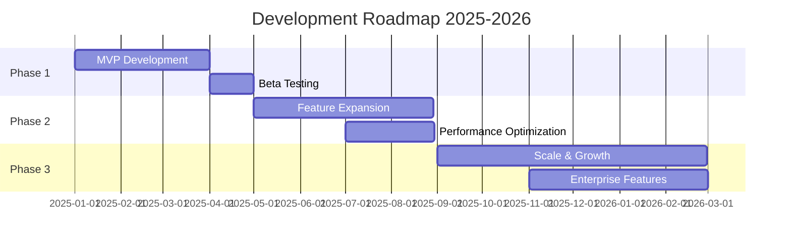

# Phần 10: Lộ trình và Kế hoạch Phát triển

## Tổng quan

Product roadmap là **strategic document** mô tả vision, direction, và progress của product theo thời gian. Theo ProductPlan, **companies với clear roadmap có 71% higher success rate**.

### Tại sao cần Roadmap?

1. **Alignment** 🎯
   - Team alignment trên shared vision
   - Stakeholder buy-in và transparency
   - Clear priorities và trade-offs

2. **Focus** 💡
   - Prevent feature creep
   - Say "no" to non-essential features
   - Maintain product quality

3. **Resource Planning** 📊
   - Budget allocation
   - Hiring plans
   - Infrastructure investment

4. **Risk Management** ⚠️
   - Identify potential blockers
   - Mitigation strategies
   - Contingency plans

### Roadmap Framework

| Quarter | Focus | Key Deliverables | Success Metrics |
|---------|-------|------------------|-----------------|
| **Q1 2025** | MVP Launch | Auth, Core Features, Payment | 100 beta users, 90% feature completion |
| **Q2 2025** | Growth | Mobile App, Analytics, API | 1K users, 70% retention |
| **Q3 2025** | Optimization | Performance, Search, Personalization | <100ms latency, 80% satisfaction |
| **Q4 2025** | Scale | Multi-region, Enterprise Features | 10K users, 99.9% uptime |
| **Q1 2026** | Expansion | AI Features, Marketplace, Integrations | 25K users, 5 enterprise customers |

---

## 10.1. Lộ trình Phát triển

### 10.1.1. Roadmap Tổng quan



### 10.1.2. Phase 1: MVP (Q1 2025)

#### Mục tiêu
- Phát hành sản phẩm khả dụng tối thiểu (MVP)
- Validate product-market fit
- Thu thập feedback từ early adopters

#### Features

**Core Features:**
- [ ] User Authentication (Email, Google, Facebook)
- [ ] User Profile Management
- [ ] Basic Dashboard
- [ ] Core Product Features
- [ ] Payment Integration (Stripe)
- [ ] Email Notifications

**Technical Implementation:**
```typescript
// Milestones for Phase 1
const phase1Milestones = [
  {
    name: 'Authentication System',
    dueDate: '2025-01-31',
    tasks: [
      'Implement JWT authentication',
      'Social login integration',
      'Password reset flow',
      'Email verification',
    ],
    assignee: 'Backend Team',
  },
  {
    name: 'User Dashboard',
    dueDate: '2025-02-15',
    tasks: [
      'Dashboard UI design',
      'User profile page',
      'Settings page',
      'Activity feed',
    ],
    assignee: 'Frontend Team',
  },
  {
    name: 'Core Features',
    dueDate: '2025-02-28',
    tasks: [
      'Feature A implementation',
      'Feature B implementation',
      'Basic search functionality',
      'Data visualization',
    ],
    assignee: 'Full Stack Team',
  },
  {
    name: 'Payment System',
    dueDate: '2025-03-15',
    tasks: [
      'Stripe integration',
      'Subscription plans',
      'Invoice generation',
      'Payment history',
    ],
    assignee: 'Backend Team',
  },
];
```

#### Success Metrics
- 100 beta users signed up
- < 5 critical bugs
- 90% feature completion
- 95% uptime

### 10.1.3. Phase 2: Growth (Q2-Q3 2025)

#### Mục tiêu
- Mở rộng tính năng dựa trên feedback
- Tối ưu hóa performance
- Tăng user base

#### Features

**User Experience:**
- [ ] Advanced Search & Filters
- [ ] Personalization Engine
- [ ] Mobile App (iOS & Android)
- [ ] Push Notifications
- [ ] Dark Mode
- [ ] Multi-language Support

**Business Features:**
- [ ] Analytics Dashboard
- [ ] Advanced Reporting
- [ ] Team Collaboration Tools
- [ ] API for Third-party Integration
- [ ] Webhook Support

**Performance:**
- [ ] CDN Implementation
- [ ] Database Optimization
- [ ] Caching Strategy
- [ ] Code Splitting
- [ ] Image Optimization

```typescript
// Phase 2 Feature Flags
const phase2Features = {
  advancedSearch: {
    enabled: true,
    rolloutPercentage: 100,
    startDate: '2025-05-01',
  },
  mobileApp: {
    enabled: true,
    platforms: ['iOS', 'Android'],
    betaRelease: '2025-06-01',
    publicRelease: '2025-07-01',
  },
  personalization: {
    enabled: true,
    algorithm: 'collaborative-filtering',
    rolloutPercentage: 50, // Gradual rollout
  },
  apiAccess: {
    enabled: true,
    tier: 'premium',
    rateLimit: 1000, // requests per hour
  },
};
```

#### Success Metrics
- 1,000 active users
- 70% user retention (30 days)
- < 100ms API response time
- 99% uptime

### 10.1.4. Phase 3: Scale (Q4 2025 - Q1 2026)

#### Mục tiêu
- Scale infrastructure
- Enterprise features
- Global expansion

#### Features

**Enterprise:**
- [ ] Single Sign-On (SSO)
- [ ] Advanced Security Features
- [ ] Audit Logs
- [ ] Custom Branding
- [ ] Dedicated Support
- [ ] SLA Guarantees

**Advanced Features:**
- [ ] AI-powered Recommendations
- [ ] Advanced Analytics & BI Tools
- [ ] Custom Workflows
- [ ] Automation Rules
- [ ] Integration Marketplace

**Infrastructure:**
- [ ] Multi-region Deployment
- [ ] Auto-scaling
- [ ] Disaster Recovery
- [ ] Advanced Monitoring
- [ ] Load Balancing

```typescript
// Infrastructure Scaling Plan
const scalingPlan = {
  regions: [
    {
      name: 'Asia-Pacific',
      locations: ['Singapore', 'Tokyo', 'Sydney'],
      targetDate: '2025-10-01',
    },
    {
      name: 'Europe',
      locations: ['London', 'Frankfurt', 'Amsterdam'],
      targetDate: '2025-11-01',
    },
    {
      name: 'Americas',
      locations: ['US-East', 'US-West', 'São Paulo'],
      targetDate: '2025-12-01',
    },
  ],
  capacity: {
    users: 100000,
    requestsPerSecond: 10000,
    storageCapacity: '10TB',
  },
  redundancy: {
    backupStrategy: 'multi-region',
    recoveryTimeObjective: '1 hour',
    recoveryPointObjective: '5 minutes',
  },
};
```

#### Success Metrics
- 10,000 active users
- 5 enterprise customers
- 99.9% uptime
- < 50ms API response time (p95)

## 10.2. Kế hoạch Mở rộng

### 10.2.1. Feature Prioritization

```typescript
// Feature Priority Matrix
interface Feature {
  name: string;
  impact: 'high' | 'medium' | 'low';
  effort: 'high' | 'medium' | 'low';
  priority: number; // 1 = highest
  quarter: string;
}

const featureBacklog: Feature[] = [
  {
    name: 'Real-time Collaboration',
    impact: 'high',
    effort: 'high',
    priority: 1,
    quarter: 'Q2 2025',
  },
  {
    name: 'Advanced Analytics',
    impact: 'high',
    effort: 'medium',
    priority: 2,
    quarter: 'Q2 2025',
  },
  {
    name: 'Mobile App',
    impact: 'high',
    effort: 'high',
    priority: 3,
    quarter: 'Q3 2025',
  },
  {
    name: 'AI Recommendations',
    impact: 'medium',
    effort: 'high',
    priority: 4,
    quarter: 'Q4 2025',
  },
  {
    name: 'Dark Mode',
    impact: 'low',
    effort: 'low',
    priority: 5,
    quarter: 'Q2 2025',
  },
  {
    name: 'Custom Themes',
    impact: 'low',
    effort: 'medium',
    priority: 6,
    quarter: 'Q4 2025',
  },
];

// Prioritization using RICE Score (Reach x Impact x Confidence / Effort)
function calculateRICEScore(feature: {
  reach: number;
  impact: number;
  confidence: number;
  effort: number;
}): number {
  return (feature.reach * feature.impact * feature.confidence) / feature.effort;
}
```

### 10.2.2. User Feedback Integration

```typescript
// Feature Request Management
interface FeatureRequest {
  id: string;
  title: string;
  description: string;
  requestedBy: string[];
  votes: number;
  status: 'proposed' | 'planned' | 'in-progress' | 'completed' | 'rejected';
  priority: 'high' | 'medium' | 'low';
  estimatedEffort: number; // in story points
  targetQuarter?: string;
}

class FeatureRequestManager {
  static async submitRequest(request: Omit<FeatureRequest, 'id' | 'votes' | 'status'>) {
    const newRequest: FeatureRequest = {
      ...request,
      id: generateId(),
      votes: 0,
      status: 'proposed',
    };

    await db('feature_requests').insert(newRequest);
    return newRequest;
  }

  static async voteForFeature(requestId: string, userId: string) {
    await db('feature_votes').insert({
      feature_request_id: requestId,
      user_id: userId,
      created_at: new Date(),
    });

    await db('feature_requests')
      .where('id', requestId)
      .increment('votes', 1);
  }

  static async getTopRequests(limit: number = 10) {
    return db('feature_requests')
      .where('status', 'proposed')
      .orderBy('votes', 'desc')
      .limit(limit);
  }

  static async updateStatus(requestId: string, status: FeatureRequest['status']) {
    await db('feature_requests')
      .where('id', requestId)
      .update({ status, updated_at: new Date() });

    // Notify users who voted
    const voters = await db('feature_votes')
      .where('feature_request_id', requestId)
      .select('user_id');

    await notifyUsers(voters, {
      type: 'feature_request_update',
      requestId,
      newStatus: status,
    });
  }
}
```

### 10.2.3. Technical Debt Management

```typescript
// Technical Debt Tracking
interface TechnicalDebt {
  id: string;
  title: string;
  description: string;
  component: string;
  severity: 'critical' | 'high' | 'medium' | 'low';
  estimatedEffort: number; // in hours
  impact: string;
  status: 'identified' | 'planned' | 'in-progress' | 'resolved';
  createdAt: Date;
  resolvedAt?: Date;
}

const technicalDebtItems: TechnicalDebt[] = [
  {
    id: 'TD-001',
    title: 'Refactor authentication logic',
    description: 'Current auth code is scattered across multiple files',
    component: 'Authentication',
    severity: 'high',
    estimatedEffort: 16,
    impact: 'Makes it difficult to add new auth methods',
    status: 'planned',
    createdAt: new Date('2025-01-15'),
  },
  {
    id: 'TD-002',
    title: 'Update deprecated dependencies',
    description: 'Several npm packages are using deprecated versions',
    component: 'Dependencies',
    severity: 'medium',
    estimatedEffort: 8,
    impact: 'Security vulnerabilities and missing features',
    status: 'identified',
    createdAt: new Date('2025-01-20'),
  },
  {
    id: 'TD-003',
    title: 'Optimize database queries',
    description: 'Several N+1 query issues in user dashboard',
    component: 'Database',
    severity: 'high',
    estimatedEffort: 12,
    impact: 'Slow page load times for users',
    status: 'in-progress',
    createdAt: new Date('2025-01-10'),
  },
];

// Allocate 20% of sprint capacity to technical debt
const sprintPlanning = {
  totalCapacity: 100, // story points
  featureWork: 80,
  technicalDebt: 20,
  bugs: 10, // deducted from feature work if needed
};
```

### 10.2.4. Platform Expansion

```typescript
// Multi-platform Strategy
const platformStrategy = {
  web: {
    status: 'launched',
    technologies: ['Next.js', 'React', 'TypeScript'],
    targetDevices: ['Desktop', 'Tablet', 'Mobile Browser'],
  },
  mobile: {
    ios: {
      status: 'planned',
      targetDate: '2025-06-01',
      technology: 'React Native',
      features: ['Offline mode', 'Push notifications', 'Biometric auth'],
    },
    android: {
      status: 'planned',
      targetDate: '2025-06-01',
      technology: 'React Native',
      features: ['Offline mode', 'Push notifications', 'Biometric auth'],
    },
  },
  desktop: {
    status: 'planned',
    targetDate: '2025-12-01',
    technology: 'Electron',
    platforms: ['Windows', 'macOS', 'Linux'],
  },
  api: {
    status: 'planned',
    targetDate: '2025-05-01',
    version: 'v1',
    documentation: 'OpenAPI 3.0',
    authentication: 'OAuth 2.0',
    rateLimit: {
      free: 100, // requests per hour
      pro: 1000,
      enterprise: 10000,
    },
  },
};
```

---

---

## 10.4. Infrastructure Evolution

### 10.4.1. Multi-Region Strategy

```typescript
// Global Infrastructure Expansion
const multiRegionStrategy = {
  // Current: Single Region (US-West)
  current: {
    region: 'us-west1',
    latency: {
      northAmerica: '<50ms',
      europe: '150-200ms',
      asia: '200-300ms',
    },
    uptime: '99.5%',
  },

  // Phase 1: Add Asia-Pacific (Q3 2025)
  phase1: {
    targetDate: '2025-09-01',
    newRegions: ['asia-southeast1'], // Singapore
    benefits: [
      'Reduced latency for Asian users (<50ms)',
      'Better user experience',
      'Market expansion',
    ],
    implementation: {
      dns: 'GeoDNS routing (Cloudflare)',
      database: 'Read replicas in Asia region',
      cdn: 'Edge caching in all regions',
      cost: '+$1500/month',
    },
  },

  // Phase 2: Add Europe (Q4 2025)
  phase2: {
    targetDate: '2025-12-01',
    newRegions: ['europe-west1'], // London
    benefits: [
      'GDPR compliance (data residency)',
      'Reduced latency for EU users',
      'Enterprise requirements',
    ],
    implementation: {
      database: 'Multi-region with synchronous replication',
      storage: 'Regional buckets',
      compliance: 'GDPR-compliant data handling',
      cost: '+$2000/month',
    },
  },

  // Target: Global Infrastructure (2026)
  target: {
    regions: [
      { name: 'us-west1', type: 'primary' },
      { name: 'us-east1', type: 'failover' },
      { name: 'europe-west1', type: 'primary' },
      { name: 'asia-southeast1', type: 'primary' },
      { name: 'australia-southeast1', type: 'secondary' },
    ],
    routing: 'Intelligent routing based on user location',
    failover: 'Automatic with health checks',
    totalCost: '$8000/month',
  },
};
```

---

### 10.4.2. Disaster Recovery Plan

```typescript
// Disaster Recovery Strategy
const disasterRecoveryPlan = {
  // Current: Basic Backups
  current: {
    backups: {
      database: 'Daily automated backups (7 days retention)',
      storage: 'Versioning enabled',
      code: 'Git repository (GitHub)',
    },
    rpo: '24 hours', // Recovery Point Objective
    rto: '4 hours',  // Recovery Time Objective
  },

  // Target: Robust DR
  target: {
    targetDate: '2025-08-01',
    backups: {
      database: {
        frequency: 'Continuous (point-in-time recovery)',
        retention: '30 days',
        location: 'Multi-region',
        testing: 'Monthly restore tests',
      },
      storage: {
        strategy: 'Cross-region replication',
        retention: '90 days',
      },
      infrastructure: {
        strategy: 'Infrastructure as Code (Terraform)',
        repository: 'Version controlled',
      },
    },
    rpo: '<5 minutes',
    rto: '<1 hour',
    
    procedures: {
      incidents: [
        {
          scenario: 'Database corruption',
          recovery: 'Restore from point-in-time backup',
          rto: '30 minutes',
          owner: 'DBA',
        },
        {
          scenario: 'Region outage',
          recovery: 'Failover to secondary region',
          rto: '15 minutes',
          owner: 'DevOps Lead',
        },
        {
          scenario: 'Data center failure',
          recovery: 'Activate DR site',
          rto: '1 hour',
          owner: 'CTO',
        },
        {
          scenario: 'Security breach',
          recovery: 'Isolate affected systems, restore from clean backup',
          rto: '2 hours',
          owner: 'Security Lead',
        },
      ],
      testing: {
        frequency: 'Quarterly',
        fullDRTest: 'Annually',
        documentation: 'Runbooks for each scenario',
      },
    },
  },
};
```

---

## 10.5. Team Growth & Organization

### 10.5.1. Hiring Roadmap

```typescript
// Team Growth Plan
const hiringPlan = {
  Q1_2025: [
    { role: 'Senior Full-Stack Engineer', salary: 120000, start: '2025-01-01' },
    { role: 'UI/UX Designer', salary: 80000, start: '2025-01-15' },
  ],

  Q2_2025: [
    { role: 'Frontend Engineer', salary: 90000, start: '2025-04-01' },
    { role: 'Backend Engineer', salary: 95000, start: '2025-04-01' },
    { role: 'DevOps Engineer', salary: 110000, start: '2025-05-01' },
    { role: 'Product Manager', salary: 100000, start: '2025-06-01' },
  ],

  Q3_2025: [
    { role: 'Mobile Engineer', salary: 115000, start: '2025-07-01' },
    { role: 'QA Engineer', salary: 75000, start: '2025-08-01' },
    { role: 'Data Engineer', salary: 120000, start: '2025-09-01' },
  ],

  Q4_2025: [
    { role: 'ML Engineer', salary: 130000, start: '2025-10-01' },
    { role: 'Security Engineer', salary: 125000, start: '2025-11-01' },
    { role: 'Engineering Manager', salary: 140000, start: '2025-12-01' },
  ],

  totalHeadcount: {
    Q1: 2,
    Q2: 6,
    Q3: 9,
    Q4: 12,
  },

  totalCost: {
    Q1: 200000,
    Q2: 595000,
    Q3: 890000,
    Q4: 1285000,
  },
};
```

---

### 10.5.2. Skill Development Program

```typescript
// Learning & Development Roadmap
const learningProgram = {
  onboarding: {
    duration: '2 weeks',
    components: [
      'Architecture overview',
      'Codebase walkthrough',
      'Development environment setup',
      'First bug fix',
      'First feature PR',
    ],
    mentorship: '1:1 buddy system',
  },

  continuous: {
    weeklyTechTalks: {
      frequency: 'Every Friday',
      format: 'Team member presents new tech/learnings',
      duration: '30 minutes',
    },

    monthlyWorkshops: {
      topics: [
        'Advanced TypeScript',
        'System design',
        'Performance optimization',
        'Security best practices',
      ],
      externalSpeakers: true,
    },

    conferenceBudget: {
      perPerson: 2000, // annually
      conferences: ['React Conf', 'JSConf', 'Google I/O'],
    },

    onlineCourses: {
      platforms: ['Frontend Masters', 'Pluralsight', 'Udemy'],
      budget: 500, // per person annually
    },

    certifications: {
      encouraged: [
        'AWS Certified Solutions Architect',
        'Google Cloud Professional',
        'Certified Kubernetes Administrator',
      ],
      reimbursement: '100%',
    },
  },

  careerProgression: {
    levels: [
      'Junior Engineer (0-2 years)',
      'Engineer (2-4 years)',
      'Senior Engineer (4-7 years)',
      'Staff Engineer (7-10 years)',
      'Principal Engineer (10+ years)',
    ],
    promotionCriteria: 'Technical skills + Leadership + Impact',
    reviewCycle: 'Bi-annual',
  },
};
```

---

## 10.6. Sustainability & Business Model

### 10.3.1. Technology Upgrades

**Technology evolution** là critical để maintain competitiveness và developer productivity.

#### Framework Migrations

```typescript
// Technology Upgrade Plan
interface TechUpgrade {
  name: string;
  from: string;
  to: string;
  reason: string;
  effort: 'low' | 'medium' | 'high';
  priority: number;
  targetDate: string;
  breakingChanges: boolean;
  migrationStrategy: string;
}

const techUpgrades: TechUpgrade[] = [
  {
    name: 'Next.js Version Upgrade',
    from: 'Next.js 13',
    to: 'Next.js 15',
    reason: 'Better performance, Turbopack, improved caching',
    effort: 'medium',
    priority: 1,
    targetDate: '2025-06-01',
    breakingChanges: true,
    migrationStrategy: 'Incremental - use App Router gradually',
  },
  {
    name: 'Node.js Upgrade',
    from: 'Node.js 18',
    to: 'Node.js 22 LTS',
    reason: 'Performance improvements, security patches',
    effort: 'low',
    priority: 2,
    targetDate: '2025-05-01',
    breakingChanges: false,
    migrationStrategy: 'Direct upgrade after testing',
  },
  {
    name: 'React Query → TanStack Query',
    from: 'React Query v3',
    to: 'TanStack Query v5',
    reason: 'Better TypeScript support, new features',
    effort: 'medium',
    priority: 3,
    targetDate: '2025-07-01',
    breakingChanges: true,
    migrationStrategy: 'Codemods + manual migration',
  },
  {
    name: 'PostgreSQL Upgrade',
    from: 'PostgreSQL 14',
    to: 'PostgreSQL 16',
    reason: 'Performance improvements, new features (MERGE command)',
    effort: 'low',
    priority: 4,
    targetDate: '2025-08-01',
    breakingChanges: false,
    migrationStrategy: 'Blue-green deployment with replica',
  },
];
```

---

### 10.3.2. Performance Optimization Roadmap

```typescript
// Performance Targets by Quarter
const performanceRoadmap = {
  Q1_2025: {
    metrics: {
      LCP: '<2.5s',  // Largest Contentful Paint
      FID: '<100ms', // First Input Delay
      CLS: '<0.1',   // Cumulative Layout Shift
      TTFB: '<200ms', // Time to First Byte
      apiLatency: '<500ms (p95)',
    },
    initiatives: [
      'Implement code splitting',
      'Add service worker for caching',
      'Optimize images with Next/Image',
      'Enable gzip compression',
    ],
  },

  Q2_2025: {
    metrics: {
      LCP: '<2.0s',
      FID: '<50ms',
      CLS: '<0.05',
      TTFB: '<150ms',
      apiLatency: '<300ms (p95)',
    },
    initiatives: [
      'Implement CDN for static assets',
      'Add database connection pooling',
      'Optimize SQL queries (remove N+1)',
      'Implement Redis caching',
      'Lazy load non-critical components',
    ],
  },

  Q3_2025: {
    metrics: {
      LCP: '<1.5s',
      FID: '<50ms',
      CLS: '<0.05',
      TTFB: '<100ms',
      apiLatency: '<150ms (p95)',
    },
    initiatives: [
      'Add read replicas for database',
      'Implement edge caching with Cloudflare',
      'Server-side rendering for critical pages',
      'Optimize bundle size (<200KB initial)',
      'Implement progressive image loading',
    ],
  },

  Q4_2025: {
    metrics: {
      LCP: '<1.2s',
      FID: '<30ms',
      CLS: '<0.05',
      TTFB: '<80ms',
      apiLatency: '<100ms (p95)',
    },
    initiatives: [
      'Multi-region deployment',
      'Database sharding',
      'GraphQL for efficient data fetching',
      'HTTP/3 support',
      'Advanced caching strategies',
    ],
  },
};
```

---

## 10.4. Infrastructure Evolution

---

## 10.6. Sustainability & Business Model

### 10.6.1. Revenue Model

```typescript
// Pricing Strategy
interface PricingTier {
  name: string;
  price: number; // monthly in USD
  features: string[];
  limits: {
    users?: number;
    storage?: string;
    apiCalls?: number;
  };
  support: string;
}

const pricingTiers: PricingTier[] = [
  {
    name: 'Free',
    price: 0,
    features: [
      'Basic features',
      'Up to 3 users',
      '1GB storage',
      'Community support',
    ],
    limits: {
      users: 3,
      storage: '1GB',
      apiCalls: 100,
    },
    support: 'Community',
  },
  {
    name: 'Pro',
    price: 29,
    features: [
      'All Free features',
      'Up to 10 users',
      '10GB storage',
      'Priority email support',
      'Advanced analytics',
      'API access',
    ],
    limits: {
      users: 10,
      storage: '10GB',
      apiCalls: 1000,
    },
    support: 'Email (24h response)',
  },
  {
    name: 'Business',
    price: 99,
    features: [
      'All Pro features',
      'Up to 50 users',
      '100GB storage',
      'Priority support',
      'Custom integrations',
      'Advanced security',
    ],
    limits: {
      users: 50,
      storage: '100GB',
      apiCalls: 10000,
    },
    support: 'Priority (4h response)',
  },
  {
    name: 'Enterprise',
    price: 0, // Custom pricing
    features: [
      'All Business features',
      'Unlimited users',
      'Unlimited storage',
      'Dedicated support',
      'SSO',
      'SLA guarantee',
      'Custom development',
    ],
    limits: {},
    support: 'Dedicated account manager',
  },
];
```

];
```

---

### 10.6.2. Cost Management

```typescript
// Monthly Cost Breakdown
const monthlyCosts = {
  infrastructure: {
    hosting: 500, // Cloud Run, Vercel
    database: 200, // Cloud SQL
    storage: 100, // Cloud Storage
    cdn: 150, // Cloudflare
    monitoring: 100, // Sentry, Datadog
    total: 1050,
  },
  services: {
    email: 50, // SendGrid
    payment: 100, // Stripe fees
    authentication: 0, // Firebase free tier
    analytics: 0, // Google Analytics free
    total: 150,
  },
  team: {
    developers: 15000, // 3 developers
    designer: 4000, // 1 designer
    productManager: 5000, // 1 PM
    total: 24000,
  },
  marketing: {
    advertising: 2000,
    content: 500,
    tools: 300,
    total: 2800,
  },
  totalMonthly: 28000,
  targetRevenue: 50000, // Break-even + profit
  requiredCustomers: {
    free: 0,
    pro: 862, // 25000 / 29
    business: 252, // 25000 / 99
    mixed: '~500 Pro + ~100 Business', // Realistic mix
  },
};
```

};
```

---

### 10.6.3. Risk Management

```typescript
// Risk Assessment
interface Risk {
  id: string;
  description: string;
  probability: 'high' | 'medium' | 'low';
  impact: 'high' | 'medium' | 'low';
  mitigation: string;
  owner: string;
}

const risks: Risk[] = [
  {
    id: 'RISK-001',
    description: 'Slow user adoption',
    probability: 'medium',
    impact: 'high',
    mitigation: 'Increase marketing efforts, improve onboarding, gather user feedback',
    owner: 'Product Manager',
  },
  {
    id: 'RISK-002',
    description: 'Competitor launches similar product',
    probability: 'medium',
    impact: 'high',
    mitigation: 'Focus on unique features, build strong community, faster iteration',
    owner: 'CEO',
  },
  {
    id: 'RISK-003',
    description: 'Technical scalability issues',
    probability: 'low',
    impact: 'high',
    mitigation: 'Regular load testing, auto-scaling, performance monitoring',
    owner: 'CTO',
  },
  {
    id: 'RISK-004',
    description: 'Key team member leaves',
    probability: 'low',
    impact: 'medium',
    mitigation: 'Knowledge documentation, cross-training, competitive compensation',
    owner: 'HR',
  },
  {
    id: 'RISK-005',
    description: 'Security breach',
    probability: 'low',
    impact: 'high',
    mitigation: 'Regular security audits, penetration testing, incident response plan',
    owner: 'Security Lead',
  },
];
```

];
```

---

## 10.7. Success Metrics & KPIs

```typescript
// Key Performance Indicators
const kpis = {
  product: {
    mau: {
      current: 0,
      target: {
        q1: 100,
        q2: 500,
        q3: 2000,
        q4: 5000,
      },
    },
    retention: {
      day1: { target: 60 },
      day7: { target: 40 },
      day30: { target: 25 },
    },
    nps: { target: 50 }, // Net Promoter Score
  },
  business: {
    mrr: {
      // Monthly Recurring Revenue
      target: {
        q1: 5000,
        q2: 15000,
        q3: 35000,
        q4: 70000,
      },
    },
    churnRate: { target: 5 }, // percent
    ltv: { target: 1000 }, // Lifetime Value
    cac: { target: 100 }, // Customer Acquisition Cost
  },
  technical: {
    uptime: { target: 99.9 }, // percent
    apiLatency: { target: 100 }, // ms (p95)
    errorRate: { target: 0.1 }, // percent
    deploymentFrequency: { target: 'daily' },
  },
};
```

};
```

---

## 10.8. Kết luận

Lộ trình phát triển cần linh hoạt và có thể điều chỉnh dựa trên feedback từ thị trường và người dùng. Quan trọng nhất là focus vào việc deliver value cho users và maintain sustainable growth.

### Key Takeaways:
1. **Start with MVP** - Launch quickly, iterate based on feedback
2. **Listen to users** - Build features that users actually want
3. **Manage technical debt** - Don't let it accumulate
4. **Plan for scale** - But don't over-engineer early
5. **Track metrics** - Data-driven decisions
6. **Be flexible** - Ready to pivot when needed

---

**Ngày cập nhật**: 05/11/2025  
**Phiên bản**: 1.0
